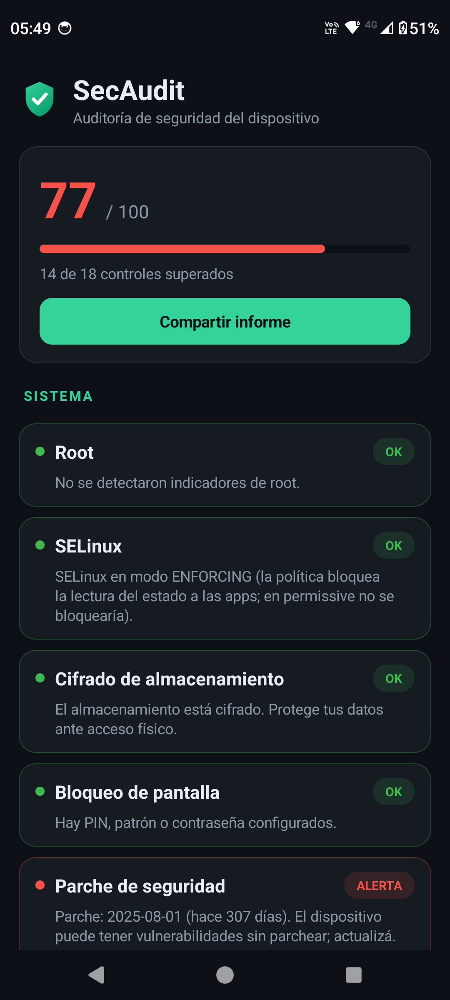
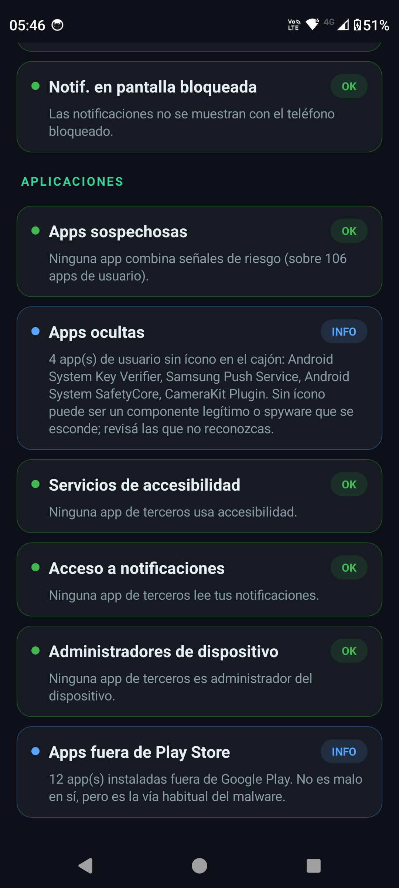
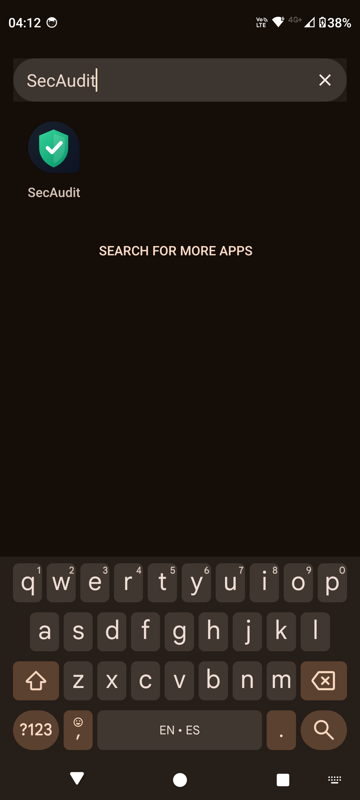

# 🛡️ SecAudit

**Auditor de seguridad para Android** — sin root, en una sola app. Revisa el estado de
seguridad del dispositivo, busca **apps ocultas o sospechosas**, calcula un puntaje
0–100 y te lleva con un botón a la pantalla de Ajustes para resolver cada alerta.

<p align="center">
  
  
  
</p>

> ⚠️ **Qué es y qué no es.** SecAudit detecta *indicadores de riesgo* y configuraciones
> inseguras leyendo lo que el sistema expone a una app normal. **No es un antivirus**
> (no tiene base de firmas) ni puede leer datos de otras apps, firmas de malware ni
> rootkits de kernel. Es una herramienta de **higiene y auditoría**.

---

## ✨ Qué revisa

Cada control se muestra como **OK / ALERTA / INFO**, agrupado por categoría, y las
alertas resolubles traen un botón **"Solucionar"** que abre la pantalla de Ajustes
correspondiente (con *fallbacks* por si el fabricante la nombra distinto).

### 🖥️ Sistema
- **Root** — busca binarios `su`, gestores tipo Magisk y capacidad de ejecutar `su`.
- **SELinux** — estado *enforcing/permissive*. Interpreta el "permiso denegado" al leer
  `/sys/fs/selinux/enforce` como prueba de **ENFORCING** (evita el falso negativo
  clásico en el que las apps no pueden leer el estado).
- **Cifrado de almacenamiento** — `DevicePolicyManager`.
- **Bloqueo de pantalla** — PIN/patrón/contraseña configurados.
- **Parche de seguridad** — antigüedad del *security patch*; alerta si supera ~6 meses.
  El botón abre el chequeo de actualizaciones de Google Play Services.
- **Firmware oficial** — `release-keys` vs `test-keys` (posible ROM custom).
- **Google Play Protect** y **Verificador de apps** — escaneo de apps de Google.

### 🛠️ Desarrollador
- **Opciones de desarrollador**, **USB Debugging (ADB)**, **ADB por WiFi**,
  **Backup ADB** (`allowBackup`), **Fuentes desconocidas** (instalación de APKs).

### 📶 Conectividad
- **WiFi**, **Bluetooth**, **NFC** (estado actual).

### 🔒 Privacidad
- **Certificados CA de usuario** — certificados raíz agregados por el usuario o una
  empresa en el almacén del sistema: principal vector de interceptación **MITM** de
  tráfico HTTPS.
- **Notificaciones en pantalla bloqueada** — alerta si el contenido sensible
  (incluidos códigos 2FA) es visible con el teléfono bloqueado.

### 📱 Aplicaciones (análisis del parque de apps)
Escaneo de todas las apps instaladas con **criterio compuesto** (varias señales
combinadas, para evitar falsos positivos). Se centra en **apps de usuario**
(no del sistema):

- **Apps sospechosas** → pantalla dedicada con cada app marcada (**ALTO/MEDIO**), sus
  **motivos** y botones **"Ver app"** (info del sistema) y **"Desinstalar"**.
- **Apps ocultas** — instaladas sin ícono en el cajón (patrón típico de *spyware*).
- **Servicios de accesibilidad** — apps que pueden leer la pantalla y simular toques
  (vector #1 de *stalkerware* y troyanos bancarios).
- **Acceso a notificaciones** — apps que leen todas las notificaciones (incl. 2FA).
- **Administradores de dispositivo** — apps que dificultan su propia desinstalación.
- **Apps fuera de Play Store** — instaladas por fuera de Google Play.

**Cómo puntúa (resumen):** suma señales como ícono oculto, accesibilidad, admin de
dispositivo, acceso a notificaciones, *overlay*, capacidad de instalar apps, `targetSdk`
muy viejo, *debuggable* y origen *sideloaded*. Los **permisos sensibles** (SMS, llamadas,
micrófono, cámara, contactos, ubicación) **solo puntúan cuando el origen NO es Google
Play** — así no marca apps legítimas de la tienda (WhatsApp, etc.). Umbral: ≥5 = ALTO,
3–4 = MEDIO.

> 🔐 **Privacidad del análisis:** todo corre **en el dispositivo**. SecAudit no envía
> nada a ningún servidor. El informe HTML se genera localmente y solo se comparte si vos
> tocás "Compartir".

---

## 📦 Cómo instalarlo en Android

La app **no está en Google Play** (se distribuye como APK). Es un *debug build* firmado
con la clave de depuración; perfecto para uso personal.

### Opción A — Instalar la APK en el teléfono (la más simple)
1. Conseguí el archivo **`app-debug.apk`** (compilalo, ver abajo, o descargalo de la
   sección *Releases* del repo si hay una publicada).
2. Pasalo al teléfono (cable USB, Google Drive, Telegram, etc.).
3. En el teléfono, abrí el archivo con tu explorador → Android te va a pedir habilitar
   **"Instalar apps desconocidas"** para esa app (navegador/archivos): permitilo.
4. Tocá **Instalar**. Listo: aparece **SecAudit** en el cajón de apps.

### Opción B — Instalar por `adb` (desde la PC)
```bash
adb install app-debug.apk
# o si ya estaba instalada:
adb install -r app-debug.apk
```

### Opción C — Compilar desde el código
Requiere JDK 17 y el Android SDK (API 34).
```bash
git clone git@github.com:lpapa1977/SecAudit.git
cd SecAudit
./gradlew assembleDebug
# APK resultante:
#   app/build/outputs/apk/debug/app-debug.apk
adb install -r app/build/outputs/apk/debug/app-debug.apk
```

### Permisos que pide y por qué
- **`QUERY_ALL_PACKAGES`** — imprescindible en Android 11+ para **enumerar todas las
  apps instaladas** y poder detectar las ocultas/sospechosas. Es un permiso de
  instalación (no pregunta en tiempo de ejecución).
- `ACCESS_NETWORK_STATE`, `ACCESS_WIFI_STATE` — estado de conectividad.

No pide cámara, micrófono, contactos, SMS ni ubicación.

---

## 🧰 Detalles técnicos
- **Lenguaje:** Kotlin · **UI:** programática (sin XML de layouts), tema oscuro propio.
- **minSdk 21** · **targetSdk 34** · `applicationId = com.test.secaudit` · versión 1.1.
- **Dependencias:** solo `androidx.core` y `androidx.appcompat` (sin librerías de red).
- **Sin internet:** la app no declara el permiso `INTERNET`.
- Probado en **Motorola edge 30 fusion (Android 14)**.

## 🗂️ Estructura
```
app/src/main/java/com/test/secaudit/
  MainActivity.kt     # chequeos de dispositivo + resumen de apps + score + informe HTML
  AppScanner.kt       # motor de escaneo de apps (scoring compuesto), sin root
  AppListActivity.kt  # pantalla dedicada de apps marcadas, con acciones
  Ui.kt               # base compartida: estilo dark, helpers de UI
```

## 📄 Licencia
Proyecto personal. Usalo bajo tu responsabilidad.
